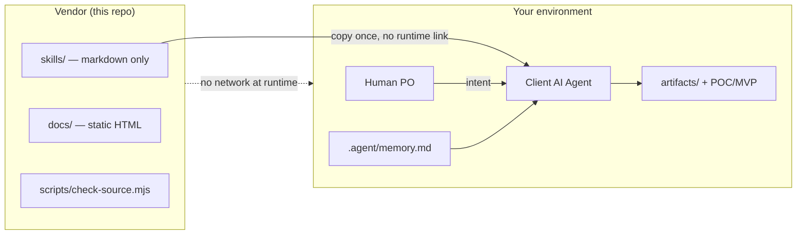

# Trust & Security Posture

This document explains what this repository contains, what it does **not** do, and how to verify the trust boundary before you install or use these skills.

**Repository:** [github.com/vignesh-s7/product-management](https://github.com/vignesh-s7/product-management)

---

## File inventory

| Path | What it is | Executes at install? |
|------|------------|----------------------|
| `skills/` | Markdown-only agent skills (`SKILL.md` + templates). Instructions for your local AI agent. | **No** |
| `.cursor/skills/` | Pre-mirrored copy of `skills/` plus `y-score-readiness` and `prd-to-sdlc` — ready on clone for Cursor. | **No** |
| `.claude/skills/` | Same skills for Claude Code users. | **No** |
| `docs/` | Static HTML portfolio demo (landing, onboarding, CuCP deck). Illustrative UI only. | **No** (served as static files; no server-side logic) |
| `scripts/check-source.mjs` | Dev-only CI source-policy checker. Run manually or in GitHub Actions. | Only when **you** run `npm run check` |
| `.github/workflows/` | CI workflows (read-only permissions, no secrets). | Only in GitHub Actions on push/PR |

### Explicit guarantee: `skills/` does not execute at install time

- **Nothing in `skills/` runs when you clone, `npm install`, or copy files.**
- Skills are plain Markdown. They contain instructions your **client-side AI agent** reads at conversation time — not executables, not install hooks, not postinstall scripts.
- `npm install` only pulls dev dependencies (`@playwright/test`) for the portfolio demo test suite. It does not load or execute skill content.

---

## Network, telemetry, and data collection

| Claim | Status |
|-------|--------|
| Network calls from skills | **None** — skills reference local filesystem paths only |
| Telemetry / phone home | **None** — no analytics SDKs, no beacon endpoints, no session reporting to us |
| Data sent to vendor | **None** — we never receive prompts, artifacts, or repo contents |
| API keys required for skills | **None** — skills use your agent's existing model and credentials |

The static demo under `docs/` may link to external CDNs for fonts or assets when viewed in a browser. That is separate from the skills layer and does not run during skill installation or agent sessions.

---

## Dual end-user model

This platform serves **two** end-user types. Both operate entirely in **your** environment.

### 1. Human users (Product Owners, designers, engineers, admins)

- Set product intent, review gate outputs, approve deliverables
- Install skills once (or use the pre-mirrored `.cursor/skills/` on clone)
- Speak to their **local** IDE agent — never to vendor servers (there are none)

### 2. Client-side AI agents (primary executors)

- Cursor Agent, Claude Code, Antigravity, or any SKILL.md-compatible agent
- Read `SKILL.md` instructions + `.agent/memory.md`
- Run persona swarm gates locally (cybersec → UX → QA)
- Write artifacts to `artifacts/` and build POC/MVP code in the client's repo

**We provide skills only.** Your agent does all execution, codegen, and artifact generation.

---

## Vendor boundary diagram

```text
┌─────────────────────────────────────────────────────────────────┐
│  YOUR ENVIRONMENT (client repo + local agent)                   │
│                                                                 │
│  Human (PO) ──intent──► Client AI Agent                         │
│                              │                                  │
│                              ├── reads .cursor/skills/ (local)  │
│                              ├── reads .agent/memory.md         │
│                              ├── runs gates (cybersec/UX/QA)    │
│                              └── writes artifacts/ + POC/MVP    │
│                                                                 │
│  No runtime connection to vendor ◄──────────────────────────────┤
└─────────────────────────────────────────────────────────────────┘

┌─────────────────────────────────────────────────────────────────┐
│  VENDOR (product-management repo — skills source only)        │
│                                                                 │
│  skills/          Markdown instructions (copy once)             │
│  docs/            Static portfolio demo (optional viewing)      │
│  scripts/         Dev-only check-source.mjs (optional verify) │
│                                                                 │
│  ✗ No hosted API    ✗ No OAuth    ✗ No telemetry              │
│  ✗ No skill execution on vendor infra                           │
└─────────────────────────────────────────────────────────────────┘
```



---

## How to verify trust

Run the source-policy checker locally:

```bash
npm install    # optional — only needed for Playwright demo tests
npm run check  # runs scripts/check-source.mjs
```

`npm run check` validates:

1. **Demo pages** — no identity sessions, no password fields, no unsafe inline scripts
2. **Workflows** — read-only permissions, no secrets, actions pinned by commit SHA
3. **Skills** — YAML frontmatter present, no banned patterns (`curl`, `wget`, shell execution, `API_KEY`, etc.)

Expected output:

```text
Source policy checks passed.
Skill validation checks passed.
```

If either line is missing or the command exits non-zero, do not proceed until you review the failure.

---

## Summary

| Question | Answer |
|----------|--------|
| Does anything in `skills/` execute on install? | **No** |
| Do skills make network calls? | **No** |
| Is there telemetry or phone-home? | **No** |
| Who runs the PO workflow? | **Your local AI agent** |
| What do we provide? | **Markdown skills + templates + install docs** |
| How do I verify? | **`npm run check`** |

---

**Author:** Vignesh AIPM · [product-management](https://github.com/vignesh-s7/product-management)
