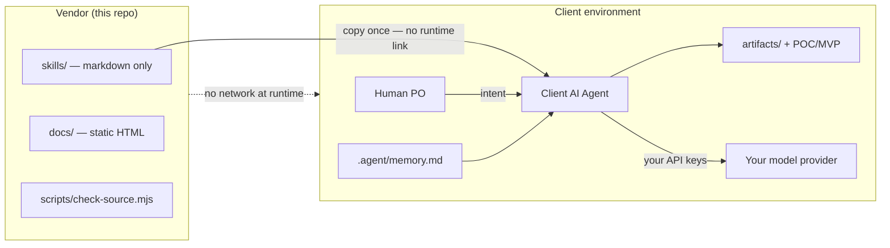

# InfoSec One-Pager — productowner-skill

**Purpose:** Give InfoSec teams a single document to approve this skills library in one review cycle.

**Author:** Vignesh AIPM · Senior PO · AI / BFSI / Healthcare  
**Repository:** [github.com/vvs-PO/productowner-skill](https://github.com/vvs-PO/productowner-skill)

---

## Executive summary

| Question | Answer |
|----------|--------|
| What is this? | A **markdown skills library** for client-side AI agents (Cursor, Claude Code, etc.) |
| What executes on install? | **Nothing** — skills are plain text instructions |
| Where does data go? | **Nowhere to us** — all execution is local in the client's environment |
| Do we need API keys to this project? | **No** |
| Is there telemetry or phone-home? | **No** |
| Who runs the PO workflow? | The **client's local AI agent**, using the client's model and credentials |

---

## What we ship

| Path | Content | Executes? |
|------|---------|-----------|
| `skills/` | Markdown `SKILL.md` files + templates | **No** |
| `.cursor/skills/` | Pre-mirrored copy for Cursor users | **No** |
| `.claude/skills/` | Pre-mirrored copy for Claude Code users | **No** |
| `docs/` | Static HTML portfolio demo (illustrative UI) | **No** (static files only) |
| `scripts/check-source.mjs` | Dev-only source-policy checker | Only when **you** run `npm run check` |
| `.github/workflows/` | Read-only CI validation | Only in GitHub Actions on push/PR |

**Explicit guarantee:** Nothing in `skills/` runs when you clone, `npm install`, or copy files into your repo. Skills contain instructions your client-side agent reads at conversation time — not executables, not install hooks, not postinstall scripts.

---

## What executes

| When | What runs | Where |
|------|-----------|-------|
| Clone / copy skills | Nothing from this repo | — |
| `npm install` | Dev dependencies only (`@playwright/test` for demo tests) | Your machine |
| Agent conversation | Client AI agent reads `SKILL.md` + writes files | Your IDE / terminal |
| `npm run check` | `scripts/check-source.mjs` (optional verify) | Your machine |
| GitHub Actions CI | Read-only PRD/skill validation | GitHub runner (your org) |

The client agent may call **your** model provider (OpenAI, Anthropic, etc.) using **your** API keys. That traffic goes to **your** configured endpoints — not to productowner-skill.

---

## Data flow — no egress to vendor

```text
┌─────────────────────────────────────────────────────────────────┐
│  CLIENT ENVIRONMENT (your repo + local agent)                   │
│                                                                 │
│  Human (PO) ──intent──► Client AI Agent                         │
│                              │                                  │
│                              ├── reads .cursor/skills/ (local)  │
│                              ├── reads .agent/memory.md       │
│                              ├── runs persona swarm gates       │
│                              │     (cybersec → UX → QA → Y-Score)│
│                              └── writes artifacts/ + POC/MVP  │
│                                                                 │
│  Model API calls ──► YOUR provider (Anthropic/OpenAI/etc.)      │
│                                                                 │
│  ✗ No connection to productowner-skill at runtime               │
└─────────────────────────────────────────────────────────────────┘

┌─────────────────────────────────────────────────────────────────┐
│  VENDOR (productowner-skill repo — skills source only)          │
│                                                                 │
│  skills/          Markdown instructions (copy once)             │
│  docs/            Static portfolio demo (optional viewing)      │
│  scripts/         Dev-only check-source.mjs (optional verify)   │
│                                                                 │
│  ✗ No hosted API    ✗ No OAuth    ✗ No telemetry                │
│  ✗ No skill execution on vendor infrastructure                  │
└─────────────────────────────────────────────────────────────────┘
```



---

## Compliance posture (skills usage)

This project is a **static skills library with no runtime**. Regulatory posture for *our* side:

| Regulation | Posture |
|------------|---------|
| **GDPR** | We do not process personal data. Users who load skills into their own agents remain the data controller for any data processed locally. |
| **HIPAA** | We are not a Business Associate — there is no hosted service that touches PHI. Healthcare skills are instructional only; HIPAA compliance is the user's responsibility in their deployment. |
| **PCI-DSS** | Skills may reference BFSI patterns (e.g. "no PAN in POC scope") but do not store, transmit, or process cardholder data. |
| **EU AI Act** | Skills include readiness-check guidance (Y-Score rubric) but do not deploy AI systems on behalf of users. |

**Client responsibility:** If agents process real PII, PHI, or financial data, that processing occurs in the client's environment under the client's controls. Skills instruct agents to use **synthetic data only** in examples and to BLOCK commits that contain detected PII/PHI patterns.

---

## InfoSec review checklist

Use this list in your security review ticket:

1. ☐ Confirm `skills/` contains **markdown only** — no `.sh`, `.py`, `.exe`, or binary executables
2. ☐ Confirm no `curl`/`wget` download-and-execute patterns in skills (CI enforces via `check-source.mjs`)
3. ☐ Confirm no references to `orchestrate.sh` as a required install step (Phase 5 — not shipped)
4. ☐ Confirm no API keys, OAuth flows, or credentials requested **to productowner-skill**
5. ☐ Confirm no telemetry, analytics beacons, or session reporting endpoints in skills or docs
6. ☐ Confirm `npm install` only pulls dev test dependencies — no skill execution on install
7. ☐ Confirm GitHub Actions workflows use `contents: read` and actions pinned by commit SHA
8. ☐ Confirm static demo (`docs/`) uses synthetic data only — no live integrations
9. ☐ Confirm dual end-user model: humans set intent; client agent executes locally
10. ☐ Confirm persona swarm gates (`cybersec-skill`) BLOCK on PII/PHI before artifact commit
11. ☐ Confirm all examples label `synthetic-data: true` in artifact frontmatter
12. ☐ Confirm regulated workloads (BFSI, healthcare) stay in client's compliant environment
13. ☐ Run `npm run check` and attach output showing both policy lines passed
14. ☐ Review [TRUST.md](../TRUST.md) vendor boundary diagram
15. ☐ Review [SECURITY.md](../SECURITY.md) vulnerability reporting and PII/PHI policy

---

## How to verify

### 1. Run the source-policy checker

```bash
git clone https://github.com/vvs-PO/productowner-skill.git
cd productowner-skill
npm install    # optional — only needed for Playwright demo tests
npm run check  # runs scripts/check-source.mjs
```

Expected output:

```text
Source policy checks passed.
Skill validation checks passed.
```

If either line is missing or the command exits non-zero, do not approve until you review the failure.

### 2. Read trust and security docs

| Document | What it covers |
|----------|----------------|
| [TRUST.md](../TRUST.md) | File inventory, network/telemetry claims, vendor boundary diagram, verification steps |
| [SECURITY.md](../SECURITY.md) | Vulnerability reporting, execution model, PII/PHI policy, GDPR/HIPAA posture, CI scope |
| [docs/CLIENT-AGENT.md](CLIENT-AGENT.md) | What the client agent does vs what we provide |

### 3. Manual spot-check (optional)

```bash
# No executables in skills
find skills .cursor/skills .claude/skills -type f ! -name '*.md' ! -name '*.yaml' ! -name '*.yml'

# No orchestrate.sh in repo (Phase 5 only)
find . -name 'orchestrate.sh' 2>/dev/null

# No banned network patterns in skills (sample)
rg -i 'curl |wget |API_KEY|telemetry|phone.home' skills/ .cursor/skills/
```

---

## Approval recommendation

**Approve for install** when:

- `npm run check` passes on the tagged release you intend to copy
- Your PO team copies skills into `.cursor/skills/` or `.claude/skills/` in **their** repo
- Agent usage stays in your controlled IDE/terminal environment
- Real PII/PHI is never pasted into demo skills or synthetic walkthroughs

**Do not approve** if a fork or vendor rep positions this as a hosted SaaS with data flowing to productowner-skill — that is Phase 6 and is not what ships today.

---

*Built by [Vignesh AIPM](https://github.com/vvs-PO) · Senior PO · AI / BFSI / Healthcare*
